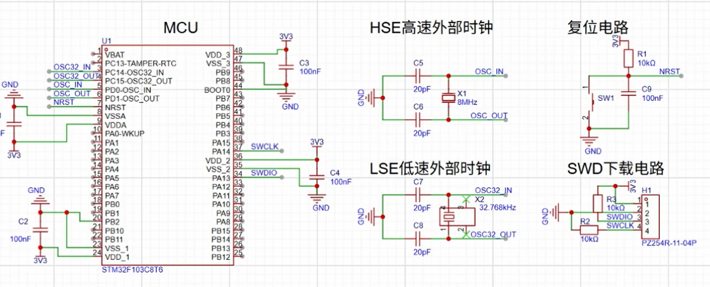
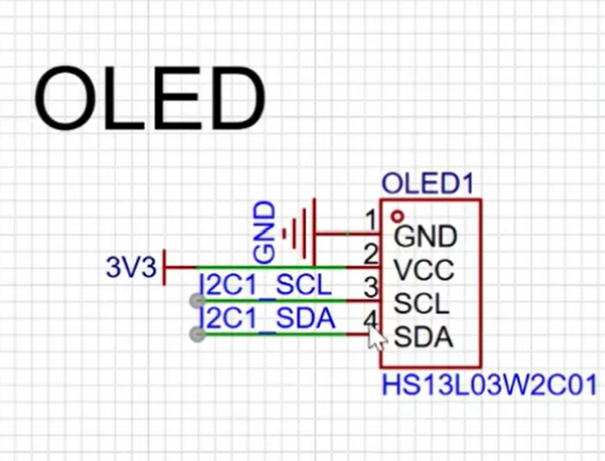

# 智能手表系统设计文档

---

# 一、物料到位情况

## 1.1 已到货物料清单

| 序号 | 物料名称 | 型号 | 数量 | 状态 |
|------|----------|------|------|------|
| 1 | 主控芯片 | STM32F103C8T6 | 1 | 已到位 |
| 2 | 显示屏 | 0.96寸 OLED（I2C接口） | 1 | 已到位 |
| 3 | 陀螺仪模块 | MPU6050 | 1 | 已到位 |
| 4 | 供电接口 | Type-C供电模块 | 1 | 已到位 |
| 5 | 蓝牙模块 | HC05 | 1 | 已到位 |
| 6 | 旋转编码器 |  | 1 | 已到位 |

---

# 二、系统方案设计

---

## 2.1 系统总体架构

本系统基于 STM32F103C8T6 设计智能手表嵌入式系统，实现姿态检测与信息显示功能。

系统组成如下：

- 主控模块：STM32F103C8T6  
- 传感器模块：MPU6050  
- 显示模块：OLED 0.96寸  
- 通信模块：I2C总线  
- 供电模块：Type-C外部供电  

---

## 系统框图
    MPU6050
       │
       │ 
       ▼

      STM32F103C8T6 ───── OLED显示屏
       │
       │
    Type-C供电

---

## 2.2 软件流程图

```

系统上电
│
▼
系统初始化（时钟 / GPIO / I2C）
│
▼
OLED初始化
│
▼
MPU6050初始化
│
▼
进入主循环
│
▼
读取MPU6050数据
│
▼
数据处理（姿态/角速度）
│
▼
OLED显示
│
▼
循环执行

```

---

# 三、详细设计文档

---

# 3.1 硬件部分

---

## 3.1.1 电路原理说明

系统采用 STM32F103C8T6 作为主控芯片，通过 I2C 总线连接 MPU6050 与 OLED，实现数据采集与显示。

### 硬件连接关系

- MPU6050 → I2C1（SCL / SDA）
- OLED → I2C1（SCL / SDA）
- Type-C → 5V输入 → 稳压供电 → STM32

---

## 电路原理图




---

# 3.2 软件部分

---

## 3.2.1 模块划分

| 模块 | 功能 |
|------|------|
| main模块 | 系统控制 |
| MPU6050驱动 | 数据采集 |
| OLED驱动 | 显示控制 |
| I2C通信 | 外设通信 |
| delay模块 | 延时控制 |

---

## 3.2.2 外设配置方案

I2C配置如下：
- 模式：Fast Mode
- 速率：400kHz
- 用途：连接 MPU6050 与 OLED

---

## 3.2.3 关键算法描述

系统通过 MPU6050 采集加速度与角速度数据，实现：

- 运动状态检测
- 姿态变化判断

---

# 四、进度汇报

---

## 4.1 当前完成情况

- 已完成硬件选型
- 已完成系统架构设计
- 已完成软件模块划分
- 已确定I2C通信方案

---

## 4.2 已完成实验

- OLED点亮测试完成

---

## 4.3 后续计划

- 完成OLED界面优化
- 完成姿态算法实现
- 完成系统联调
- 优化刷新率与稳定性

---

# 五、总结

本系统基于 STM32F103C8T6 构建，通过 I2C 总线实现 MPU6050 与 OLED 的数据交互，实现智能手表基础功能，具有较好的扩展性与工程实践价值。
